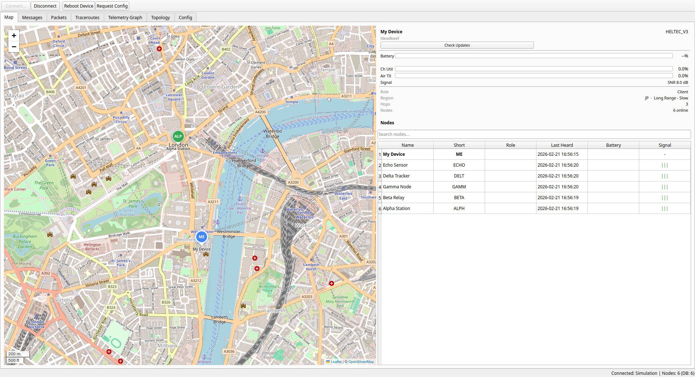
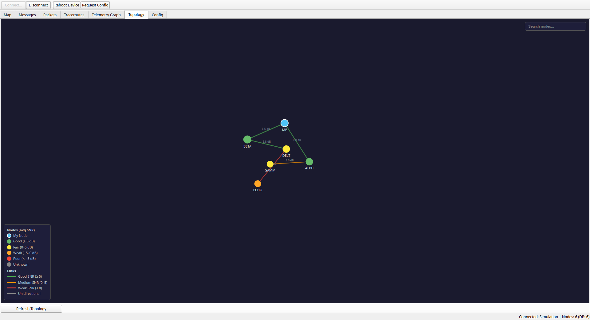
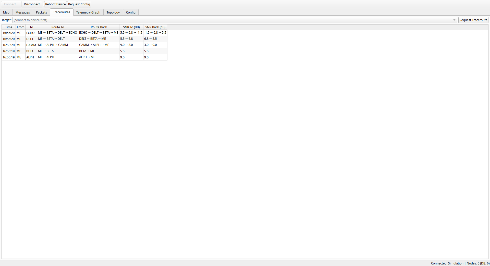
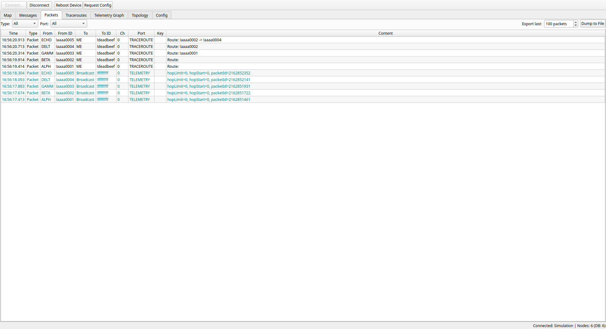
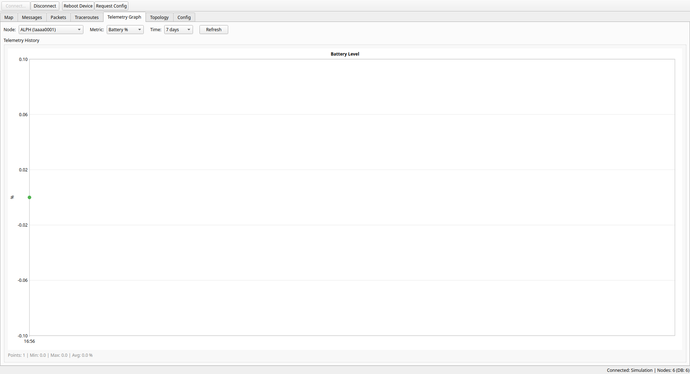
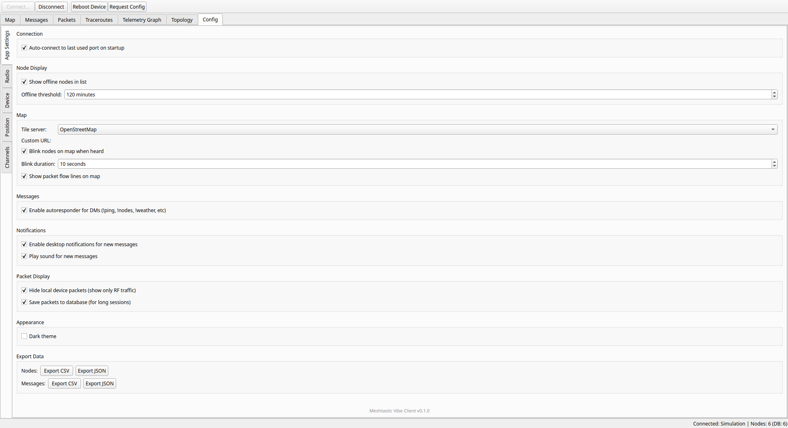

# Meshtastic Vibe Client

A Qt6 desktop client for [Meshtastic](https://meshtastic.org/) mesh radio devices. Connects over USB serial, TCP, or Bluetooth and gives you a full desktop UI for monitoring and messaging your mesh network.



---

## Features

- **Live map** — nodes plotted on OpenStreetMap (Leaflet), blink on activity, click for details
- **Topology graph** — force-directed RF link graph with SNR-based node/link colouring
- **Traceroutes** — request and inspect hop-by-hop routes with per-hop SNR both ways
- **Packet inspector** — live packet log with type/port/node filters and CSV/JSON export
- **Messaging** — channel and direct-message UI with desktop notifications and sound alerts
- **Telemetry graphs** — battery, SNR, channel utilisation over 1 h / 6 h / 24 h / 7 days
- **Device config** — read and write LoRa, device, position and channel settings
- **Encryption** — AES-128/256-CTR decryption with brute-force fallback across all 255 simple PSKs
- **Autoresponder** — replies to `!ping`, `!nodes`, `!weather` direct messages
- **Simulation mode** — full UI exercise without any hardware (see below)

---

## Screenshots

### Map
Node positions on OpenStreetMap. Nodes blink when a packet is heard. Click any node to select it and see its details in the sidebar.


### Topology
Force-directed graph built from traceroute and neighbour-info data. Node colour reflects average SNR; link width and colour reflect signal quality.



### Traceroutes
Every traceroute response is logged with the full forward and return path and per-hop SNR values. Select a row to highlight the path on the map and topology graph.



### Packet Inspector
Full packet log with type, port, source, destination and decoded content. Filter by type or port, export last N packets to CSV or JSON.



### Telemetry Graph
Battery level, voltage, SNR and channel utilisation history per node. Switch metric and time range with the dropdowns.



### Config
App settings (map tile server, notifications, dark theme, export) plus device radio/position/channel config tabs that read from and write to the connected device.



---

## Quick Start

### Linux

```bash
# Install dependencies
sudo apt-get install -y cmake build-essential qt6-base-dev qt6-serialport-dev \
  qt6-webengine-dev qt6-connectivity-dev \
  libprotobuf-dev protobuf-compiler libssl-dev libqrencode-dev

# Build
mkdir -p build && cd build
cmake ..
cmake --build . -- -j$(nproc)

# Run
./meshtastic-vibe-client
```

### Windows

Install [Qt 6.5+](https://www.qt.io/download), [vcpkg](https://github.com/microsoft/vcpkg), and Visual Studio 2022, then:

```powershell
vcpkg install protobuf:x64-windows openssl:x64-windows

mkdir build-win && cd build-win
cmake -G "Visual Studio 17 2022" -A x64 `
  -DQt6_DIR="$env:Qt6_DIR" `
  -DCMAKE_TOOLCHAIN_FILE="C:/vcpkg/scripts/buildsystems/vcpkg.cmake" ..

cmake --build . --config Release
```

A pre-built Windows installer is available on the [Releases](../../releases) page.

---

## Connecting to a Device

On first launch click **Connect…** in the toolbar and choose your connection type:

| Type | Details |
|------|---------|
| **Serial / USB** | Auto-detected. Pick the port from the dropdown (e.g. `/dev/ttyUSB0`, `COM3`). Enable *Auto-connect on startup* in Config to reconnect automatically. |
| **TCP** | Enter host and port (default 4403). Works with the Meshtastic TCP bridge or a device running in WiFi AP mode. |
| **Bluetooth** | Scan and pair from the Connect dialog. Requires the device to be in pairing mode. |

---

## Simulation Mode

Run without any hardware to try out all UI features:

```bash
# Basic: 6 simulated nodes, neighbour links, 5 traceroutes
./meshtastic-vibe-client --simulate basic

# Reconnect: same as above, drops connection after 10 s and reconnects after 3 s
./meshtastic-vibe-client --simulate reconnect
```

Simulation data is kept in an in-memory database — nothing is written to disk and your real node data is never affected.

---

## Testing

Unit tests live in `tests/` and run via CTest:

```bash
cd build
ctest --output-on-failure   # Linux
ctest -C Release --output-on-failure   # Windows
```

| Suite | File | Covers |
|-------|------|--------|
| `Protocol` | `tests/test_protocol.cpp` | Frame parser — sync, split frames, garbage bytes |
| `NodeManager` | `tests/test_nodemanager.cpp` | Node CRUD, telemetry, `nodesChanged` debounce |

---

## Key Source Files

| File | Purpose |
|------|---------|
| `src/MeshtasticProtocol.cpp` | Protobuf encode/decode, AES decryption, frame parser |
| `src/SerialConnection.cpp` | USB serial transport (115200 baud) |
| `src/TcpConnection.cpp` | TCP transport with auto-reconnect |
| `src/BluetoothConnection.cpp` | BLE transport |
| `src/NodeManager.cpp` | Node lifecycle, position filtering, telemetry |
| `src/SimulationConnection.cpp` | Fake device for UI testing |
| `resources/map.html` | Leaflet map (Qt WebEngine bridge) |
| `resources/topology.html` | Force-directed graph (vanilla JS) |
| `tests/` | Qt Test unit tests |

---

## CI

GitHub Actions builds and tests on every push and PR:

- **Linux** (`ubuntu-latest`): CMake → build → `ctest` → DEB package (on tag)
- **Windows** (`windows-latest`): MSVC → CMake → build → `ctest -C Release` → NSIS installer (always)

Releases are created automatically when a `v*` tag is pushed, attaching the `.deb` and `.exe` installer.
